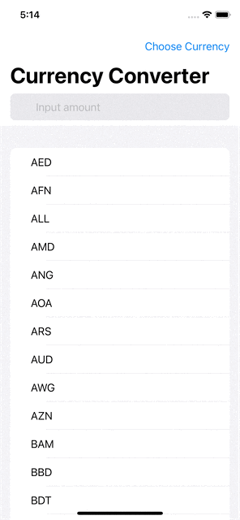
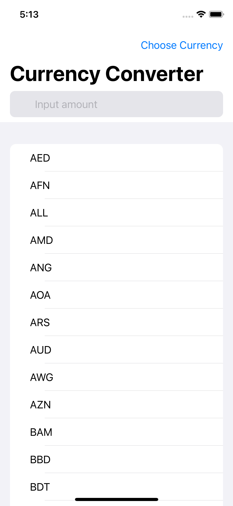
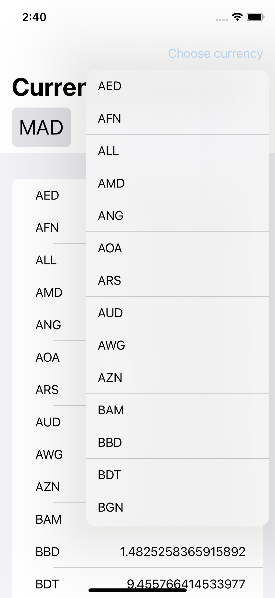
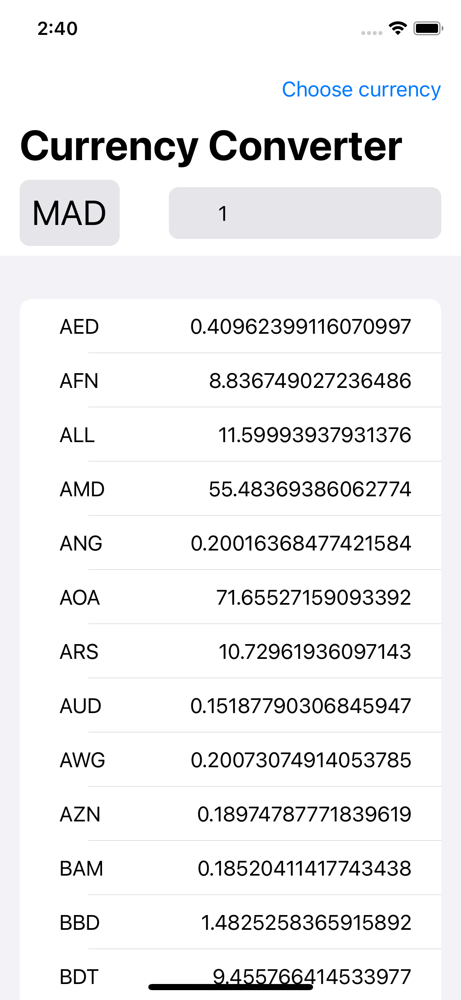

# Currency Converter App

## Tools Used

* XCode version 12.5.1
* iOS Simulator 

## Technology Used

* SwiftUI
* Combine
* Core Data

## Architecture Pattern

* MVVM

## <u>App Demo</u>

    

## <u>App Screenshots</u>

	
	
    	

